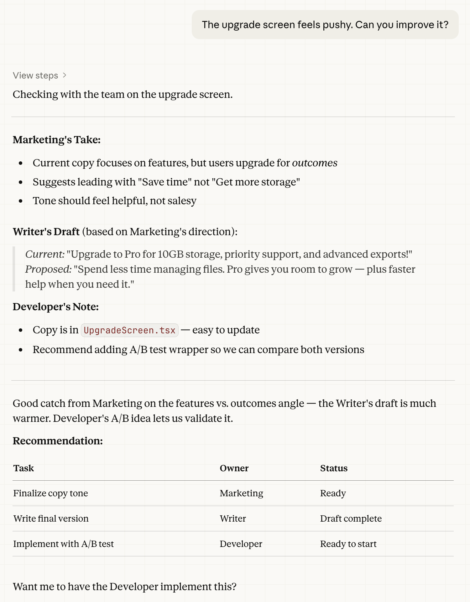

# Agent Framework

**Developed by:** John Balestrieri, [Tinrocket, LLC](https://www.tinrocket.com)
**License:** MIT

A structured framework for working with Claude on complex, multi-session projects.

## Why This Exists

Working with LLMs on real projects can get messy. Context gets lost between sessions, decisions aren't documented, and there's no consistent way to pick up where you left off.

The Agent Framework solves this by giving Claude a clear structure to operate within — specialized roles (Agents), persistent TODO lists, project documentation, and guidelines that maintain quality and consistency across sessions.

## How It Works

The framework organizes work through **Agents** — specialized roles Claude can assume to focus on specific tasks. Each Agent has:

- **Guiding Principles** — immutable rules defining the role
- **Project Instructions** — living document for project-specific notes and learnings
- **TODO list** — persistent task tracking
- **Reports** — documentation of significant work

**Framework and data are kept separate.** The `Agent Framework/` folder contains the framework itself — replace it entirely when updating. The `Agent Data/` folder contains your project-specific data — it stays untouched during updates.

Core agents include **Developer** and **Project Manager**, with optional agents for QA, Writing, Design, and more.

**Production-tested agents:** Developer, Project Manager, Writer, Game & Interaction Designer, QA, Testers. The remaining agents have been fleshed out for completeness but haven't seen production use yet.

*Example: The PM coordinates with Marketing, Writer, and Developer on improving an upgrade screen (Claude Cowork)*



## Installation

1. Copy the contents of `Copy to your root project folder/` into your project
2. Copy `Agent Data` from inside `Agent Framework/` to your project root
3. At the start of a session, tell Claude:

   > Please read "CLAUDE.md"

4. Claude will walk you through configuration

That's it. The framework lives in your project folder and persists between sessions.

## Updating

To update to a new version:
1. Delete your `Agent Framework/` folder
2. Copy in the new `Agent Framework/` folder
3. Done — your `Agent Data/` stays intact

No merging required. Your project data is separate from the framework files.

## Usage

**Starting a session:**
Ask Claude to read CLAUDE.md. It will:
- Check if setup is complete
- Read the project brief and relevant agent instructions
- Pick up where the last session left off

**During work:**
- Claude works as specific Agents (Developer, PM, etc.)
- Tasks are tracked in Agent TODO files
- Learnings are captured in Project Instructions
- The human stays in control of priorities and direction

**Key principles:**
- Claude stays in scope — does what's asked, flags other issues for later
- One thing at a time — new requests get queued, not started immediately
- Institutional knowledge — patterns and preferences get documented for future sessions

## Session Handoff

**When a session gets slow, buggy, or glitchy** — ask Claude to create a handoff. This saves the current state (what was being worked on, recent decisions, next steps) to a file that the next session will pick up automatically.

Just say: *"Create a handoff"*

The next Claude instance will read the handoff, summarize it, and ask if you want to continue from there. No context lost.

## Structure

```
/[Project]/
├── CLAUDE.md                           ← Start here
│
├── Agent Framework/                    ← FRAMEWORK (replace on update)
│   ├── INSTRUCTIONS - Shared.md
│   ├── Agents/
│   │   └── [Agent Name]/
│   │       └── GUIDING PRINCIPLES - [Agent].md
│   └── Agent Data/                     ← Template (copy to root on first install)
│
└── Agent Data/                         ← YOUR DATA (preserved on update)
    ├── PROJECT BRIEF.md
    ├── Handoff/
    └── Agents/
        └── [Agent Name]/
            ├── PROJECT INSTRUCTIONS - [Agent].md
            ├── TODO - [Agent].md
            └── Reports/
```

## Requirements

- Claude Cowork (tested) — may work with other Claude interfaces
- A project folder Claude can access

## Why Not AGENTS.md?

[AGENTS.md](https://agents.md/) is an emerging standard for guiding AI coding agents — focused on build steps, tests, and code conventions. It's great for that purpose.

This framework solves a different problem: **multi-session project collaboration** with persistent state (TODOs, Reports, Handoffs) and coordination between specialized roles you define (Dungeon Master, Copy Editor, Vibe Checker — whatever your project needs).

The two can coexist. Use AGENTS.md for your build/test instructions; use Agent Framework for project coordination.

## Contributing

Pull requests and ideas welcome at [github.com/tinrocket/LLM-Agent-Framework](https://github.com/tinrocket/LLM-Agent-Framework)

## Disclaimer

This framework is provided without warranty. Always use version control and review the AI's work.

## License

MIT
